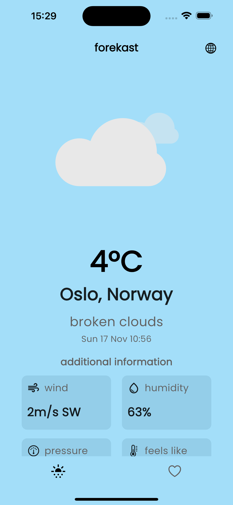
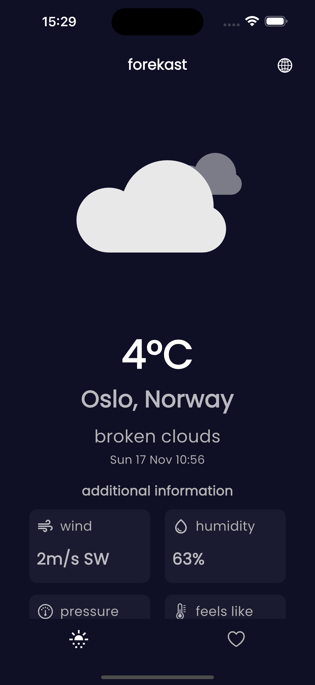
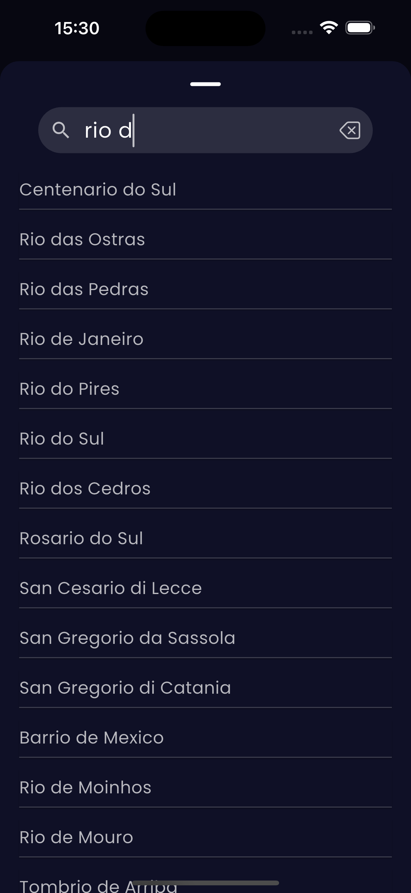
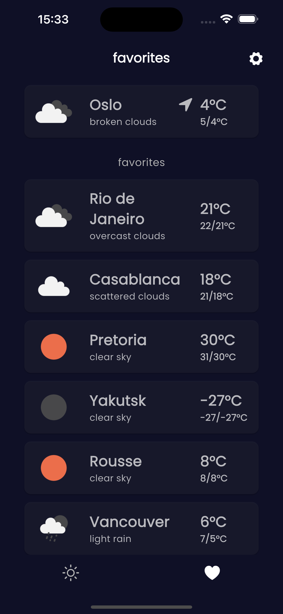

## Forekast

A simple minimalist weather application for Android and iOS (yet to be rolled out) devices

### Features

- Get the weather information of your current location, or choose a default location manually without allowing device location service
- Daily weather forecast for the next 8 days
- Add up to 8 cities as favorites
- Set a favorite city as default location (let's say your home location and you are residing somewhere else)
- Swipe right or left on favorite city for more actions
- Open the city in maps (Apple maps or Google maps based on platform)
- [Settings] Change theme
- [Settings] Reset location if you wish to disable location service for this app and choose a city manually

### Screenshots

  <figure style="margin-right: 2px;">
    
    <figcaption>Forekast page (light)</figcaption>
  </figure>

  <figure style="margin-right: 2px;">
    
    <figcaption>Forekast page (dark)</figcaption>
  </figure>

  <figure style="margin-right: 2px;">
    
    <figcaption>City search</figcaption>
  </figure>

  <figure>
    
    <figcaption>Favorites page</figcaption>
  </figure>

### Links

Download the Android APK [here](https://github.com/Pragades-Rajagopal/forekast-app/releases/tag/v1.0.0) (v1.0.0)

> Your feedback is much appreciated!
